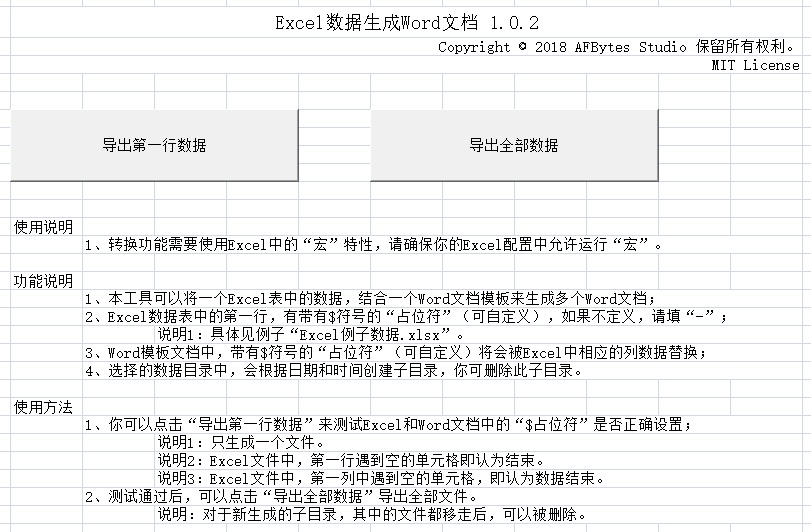
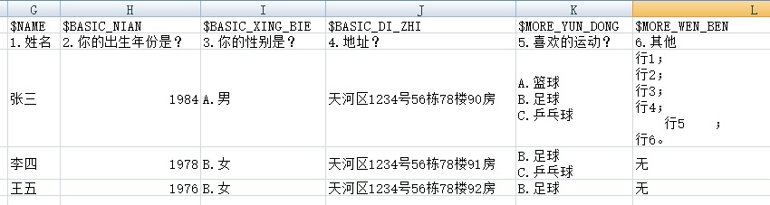
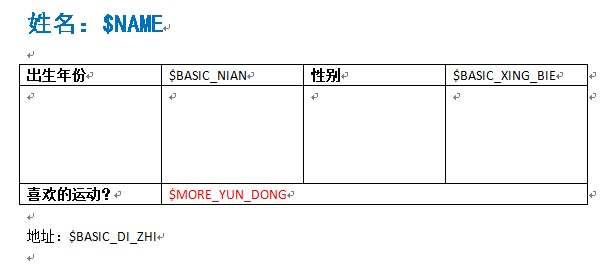
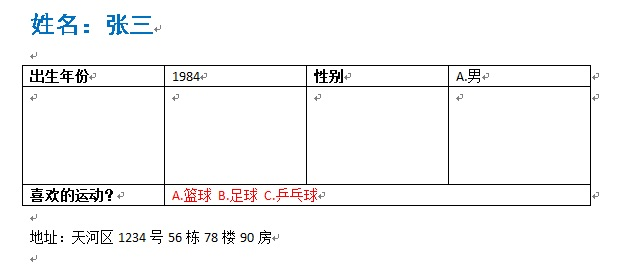

将Excel数据表的数据导出到多个Word文件中，每行一个文件，Word文件格式可自定义。(Export the data in Excel file to Word files, one DOC file per row; and you can customize the format in the Word files.)

example目录中有例子文件。

## 安装

无需安装。下载[Excel文件](./release/Excel数据生成Word文档v1.0.2.xlsm)并打开即可。

## 使用说明

1、工具主界面

2、例子文件和导出的子目录

3、例子Excel中的数据（留意第一行中带$的占位符）

4、例子Word模板 

5. 导出的第一个Word文件的例子

## Dev Tip

为免不必要的误修改，工作簿、工作表和VBA代码被加上了保护，密码均是：`afbytes`。

To avoid unexpected modification, the workbook, worksheet and VBA code are projtected, and the password is: `afbytes`.

## License

MIT License
